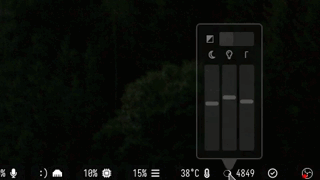

### wl-gammarelay-applet
#### Control wl-gammarelay-rs via applet.



`wl-gammarelay-applet` is a small desktop applet for controlling `wl-gammarelay-rs` via DBus.

This applet is written in Rust and provides a [Slint](https://github.com/slint-ui/slint) UI.

The applet is configurable:
```
$ wl-gammarelay-applet --help
Control wl-gammarelay-rs via applet.

Usage: wl-gammarelay-applet [OPTIONS]

Options:
  -i, --hide-invert                    Hides switch that controls Invert
  -t, --hide-temperature               Hides slider that controls Temperature
  -b, --hide-brightness                Hides slider that controls Brightness
  -g, --hide-gamma                     Hides slider that controls Gamma
  -c, --hide-caret                     Hides "speech bubble" caret at bottom of applet
  -l, --hide-labels                    Hides text labels of control widgets
  -v, --hide-value                     Hides text value of active control widgets
  -f, --never-fade                     Set this flag to never automatically fade the window
  -p, --outer-padding <OUTER_PADDING>  Set applet window outer padding [default: 8]
  -x, --window-width <WINDOW_WIDTH>    Set applet window width (horizontal) [default: 100]
  -y, --window-height <WINDOW_HEIGHT>  Set applet window height (vertical) [default: 220]
  -h, --help                           Print help
  -V, --version                        Print version
```

#### Usage

Click, drag, or scroll the sliders to change the values. `shift + scroll` changes the value in smaller increments. Right-clicking a slider will set it to the default value. If you resize windows in your compositor with the `meta` key, the applet window can be resized. Pressing `escape` will close the window.

#### Changes

0.1.4 changes:
- [x] Text label showing set value.
- [x] Lock fade if shift or meta pressed.
- [x] Option to never fade out.
- [x] Esc to close window.
- [x] Configurable default value.
- [x] Right-click to reset to default.

0.1.3 changes:
- Switch to blocking zbus proxy.
- Round temperature adjustments to nearest 100.
- Safely mutate settings, call DBus proxy from threads.

Known issue(s):
- There can be drift when changing sliders with wheel or left click. Usually not a problem.

Contribution welcome.

#### Getting Started
Install [wl-gammarelay-rs](https://github.com/MaxVerevkin/wl-gammarelay-rs) as needed.

To build `wl-gammarelay-applet`, here is a suggestion:
```bash
git clone https://github.com/junelva/wl-gammarelay-applet.git
cd wl-gammarelay-applet
cargo build --release
ln -s $(pwd)/target/release/wl-gammarelay-applet ~/bin/wl-gammarelay-applet
```

#### Configuration in Waybar
Suggestion:
```json
"custom/wl-gammarelay-applet": {
    "format": "❍ {}",
    "exec": "wl-gammarelay-rs watch {t}",
    "on-click": "wl-gammarelay-applet",
    "on-scroll-up": "busctl --user -- call rs.wl-gammarelay / rs.wl.gammarelay UpdateTemperature n +100",
    "on-scroll-down": "busctl --user -- call rs.wl-gammarelay / rs.wl.gammarelay UpdateTemperature n -100"
},
```

Different configurations not widely tested. Feedback welcome.

#### Configuration in Sway
Add to `~/.config/sway/config`:
```swayconfig
for_window [app_id="wl-gammarelay-applet"] sticky enable, move position cursor, move up 20
```

#### Curiosity
```bash
# Open a simple window that does not automatically close.
wl-gammarelay-applet -fc

# Display only brightness and gamma with caret.
wl-gammarelay-applet -it -p0 -x175

# Display only the unlabeled gamma slider.
wl-gammarelay-applet -bltic

# Display a dark, empty square.
# Could this be the perfect GUI?
wl-gammarelay-applet -bigtlc -p 100
```
